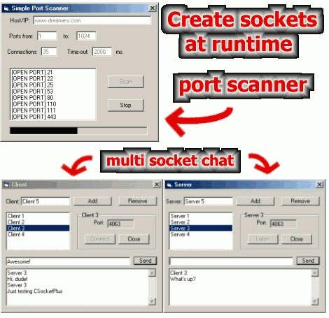



## CSocketMaster 1\.2 & CSocketPlus 1\.1 \- Winsock classes

### Description

CSocketMaster class is a winsock control substitute. It has the same interface and behavior winsock has so don't worry about having to learn how to use it. If you know how winsock works then you already know how CSocketMaster works. You can use a socket in a form, user control or class without external dependencies or huge memory leaking OCXs. This new version has some bugs fixed including the binding problem when you have more than one internet interface; now the client sockets bind to the default gateway. With CSocketPlus you can accomplish the same things CSocketMaster does plus you can create sockets at runtime. You can use a long value or a string as an index and create socket arrays very fast. Both are IDE safe, so you can press the end button without crashing the program. Take a look at the readme file for more info. Both classes are based on CSocket by Oleg Gdalevich that can be found on www.vbip.com. Keywords: socket, winsock, tcp, udp, internet, lan.
 
### More Info
 

             |
---                |---
**Submitted On**   |2004-06-30 18:01:16
**By**             |[Emiliano Scavuzzo](https://github.com/Planet-Source-Code/PSCIndex/blob/master/ByAuthor/emiliano-scavuzzo.md)
**Level**          |Intermediate
**User Rating**    |5.0 (99 globes from 20 users)
**Compatibility**  |VB 5\.0, VB 6\.0
**Category**       |[Internet/ HTML](https://github.com/Planet-Source-Code/PSCIndex/blob/master/ByCategory/internet-html__1-34.md)
**World**          |[Visual Basic](https://github.com/Planet-Source-Code/PSCIndex/blob/master/ByWorld/visual-basic.md)
**Archive File**   |[CSocketMas176430712004\.zip](https://github.com/Planet-Source-Code/emiliano-scavuzzo-csocketmaster-1-2-csocketplus-1-1-winsock-classes__1-54681/archive/master.zip)

